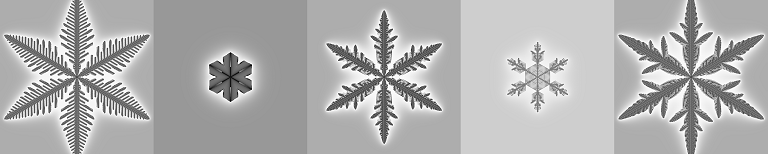

# Snowflake Generator



## Overview

A cellular automata that generates snow crystals as described in [1].

Written in Python 3, doesn't require external packages.  
It produces svg files. An example can be found in [media](./media/). Other examples have been rasterized.  
It is slow; it runs on a single thread and has not been optimized.  

## Usage

```python3
from snowflake import Automata, save_svg

automata = Automata(100)
automata.grow(100)
save_svg(automata, "snowflake.svg")
```

There are a few examples in [examples.py](./examples.py).

## References

1. Gravner, J., Griffeath, D. (2008). [Modeling snow crystal growth II: A mesoscopic lattice map with plausible dynamics](https://doi.org/10.1016/j.physd.2007.09.008).


## Similar projects
Python 2 : https://github.com/vishnubob/snowflake  
Rust, multithreaded: https://github.com/necocen/snowflake  
OpenGL fragment shader: https://www.shadertoy.com/view/43tcRN
